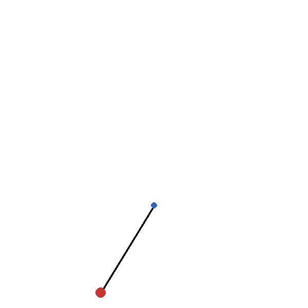

# Balancing Inverted Pendulum via Reinforcement Learning  
**Internship Project – RESOLVE (SUPARCO)**  



---

## Project Overview  

This applied engineering project uses Proximal Policy Optimization (PPO) to train a reinforcement learning (RL) agent for balancing an inverted pendulum under different gravitational settings. It was developed as part of our internship at RESOLVE (SUPARCO), where our team was assigned this task to gain practical experience in reinforcement learning and control systems.  

The primary goal was to train an agent that can maintain the pendulum in its upright position by applying torque, while testing performance in multiple environments such as Earth gravity, lunar gravity, and microgravity. The implementation supports configurable pendulum mass and length to allow flexible experimentation.  

---

## Key Features  

- **Custom Physical Settings** – Test control under Earth (g = 9.8), lunar (g = 1.6), and zero-gravity (g = 0) conditions.  
- **PPO-Based RL Agent** – Implemented using Stable-Baselines3 with automatic evaluation callbacks.  
- **Live Training Monitoring** – Reward graph visualization during training for instant feedback.  
- **Experiment Tracking** – Automatically saves models, logs, plots, and training graphs.  
- **Post-Training Analysis** – Generates CSV rollouts and detailed performance plots (angle, velocity, torque, reward).  

---

## Example Output Structure  

Training results are automatically organized per gravity setting under timestamped folders:  

```
results/
└── 2025-08-13_14-20-30_g9_8/
    ├── ppo_pendulum_best_model.zip
    ├── rollout.csv
    ├── angle_over_time.png
    ├── angular_velocity.png
    ├── torque_histogram.png
    ├── reward_over_time.png
    ├── training_rewards_g9_8_20250813_142501.png
    ├── simulation.gif (optional)
    └── meta.txt
```

---

## Getting Started  

### Prerequisites  
- Python 3.8+  

Install required libraries:  
```bash
pip install gymnasium stable-baselines3 pygame imageio matplotlib
```

### Configuration  
Adjust values in `config.py` to customize experiments:  
```python
TEST_GRAVITIES = [0.0, 9.8, 1.6]  # Gravity cases to test
MASS = 1.2                        # Pendulum mass (kg)
LENGTH = 0.75                     # Pendulum length (m)
TOTAL_TIMESTEPS = 150_000         # Training duration
SAVE_GIF = True                   # Save pendulum simulation as GIF
RENDER_WINDOW = False             # Toggle live visualization
```

### Running the Project  
Train and evaluate the RL agent with:  
```bash
python main.py
```
This will sequentially train and analyze the agent for each gravity setting, saving outputs to the `results/` directory.

---

## How It Works  

1. **Environment Setup** – Creates a custom Gymnasium Pendulum-v1 environment with modified parameters.  
2. **Training** – PPO learns to balance the pendulum with continuous torque control; EvalCallback saves the best-performing model.  
3. **Live Visualization** – Training rewards are plotted in real time and stored automatically.  
4. **Evaluation** – Trained models are rolled out to log detailed performance metrics.  
5. **Metadata Logging** – Records gravity, mass, length, and timestep settings per run.  

---

## Next Steps  
 
- Transfer trained policies to physical hardware or higher-fidelity simulators.  
- Compare PPO with alternative RL algorithms such as SAC or DDPG.  

---

